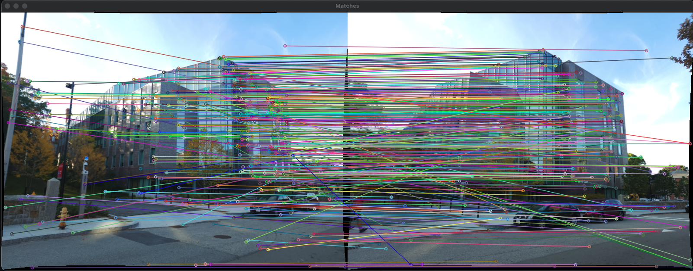
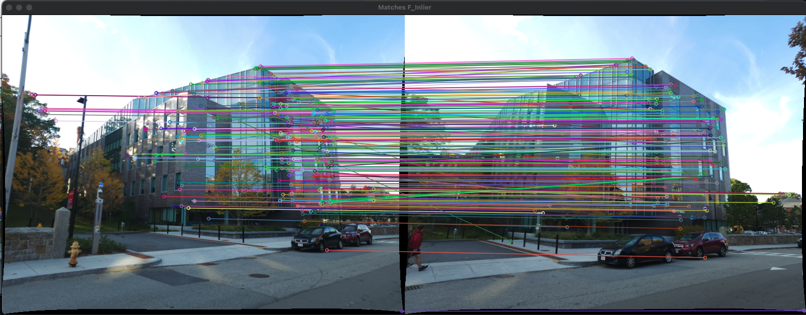
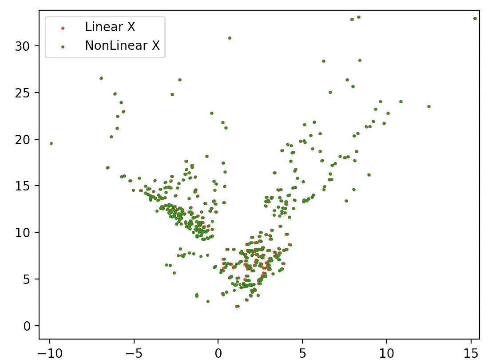
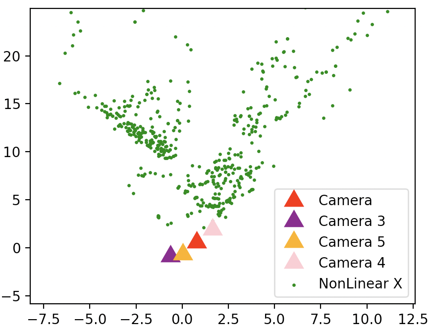

# RBE549 Buildings Built in Minutes
Using SfM and NeRF for 3D reconstruction

<embed src="/RBE549_SfM_NeRF.pdf"  width="500" height="375">

### NERF Output

 
 

### SfM Output

#### All Feature matches between two cam poses

 
 

#### Feature inliers using RANSAC

 
 

#### Triangulation (linear and non-linear comparison) after disambigualtion

 
 

#### All camera poses

 
 

Report:

https://github.com/TriptSharma/SfM_and_NeRF/blob/main/RBE549_SfM_NeRF.pdf
